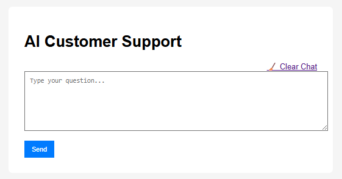
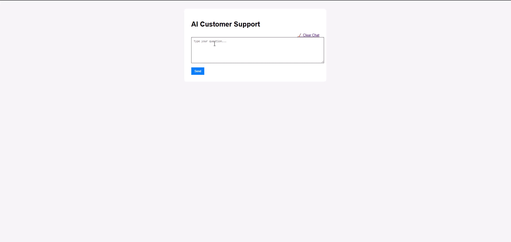

# AI-Powered Customer Support System

**Last Updated:** June 2025

## Overview

This is a fully containerized AI-powered customer support web application that provides automated responses 24/7, stores conversations, gathers user feedback, and improves performance over time through fine-tuning. It is designed with modularity and extensibility in mind.

## Features

- Automated chatbot using a locally hosted LLM (TinyLlama or Mistral)
- Feedback collection on every interaction
- Weekly retraining based on low-rated interactions using LoRA fine-tuning
- GGUF format conversion for efficient inference
- SQLite-based conversation and feedback tracking
- Cron-based scheduled retraining inside Docker

---

## Folder Structure

```
├── app.py                  # Flask app
├── Dockerfile              # Web app Dockerfile
├── Dockerfile.trainer      # Training container with GGUF support
├── docker-compose.yml
├── fine_tune/              # Fine-tuning scripts and training data
│   └── train_lora.py
├── llama.cpp/              # For GGUF conversion
├── models/
│   └── TinyLlama-1.1B-Chat-v1.0/
│   └── latest_gguf/ -> symlink to latest model version
├── templates/              # Jinja2 templates
├── static/                 # CSS/JS/images
├── instance/               # SQLite DB
└── README.md
```

---

## Screenshots / GIFs








---

## CI/CD Options

### GitHub Actions (recommended for open-source or cloud repos)

- Trigger on commit to `main` branch
- Build and push Docker image
- Run fine-tuning job on schedule
#### TODOs
- [ ] Add a workflow to `.github/workflows/train.yml`


### Jenkins (recommended for internal or enterprise use)

- Create pipeline job
- Mount model and data volumes
- Use `docker-compose run trainer`
- Schedule via Jenkins cron syntax

---

## Running the System

```bash
docker-compose up --build
```

To manually trigger training:

```bash
docker-compose run --rm trainer
```

To schedule weekly retraining: Handled by `cron` container in Docker Compose. Runs every Monday 3AM.

---

## Future Scalability

- Can be scaled to Kubernetes using `kompose` or manual manifests
- Use volumes or object storage for model checkpoints
- Swap SQLite with PostgreSQL for production
- Add OpenTelemetry for tracing

---

## License

MIT
